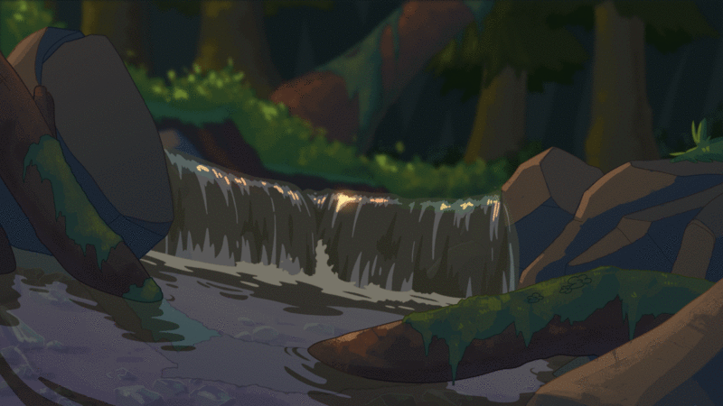

# Hi 👋, I'm Niklas

  

## About Me:

<table>
<tr>
<td>

- 🎓 I'm training to become an IT specialist
- 💻 I build small projects on the side using TypeScript and Python
- 💻 I use daily: `.ts`, `.js`, `.py`, `.tsx`, `.jsx`
- 💬 Talk to me about web development, TypeScript, React or small project ideas

</td>
<td>

</td>
</tr>
</table>

## 🛠️ Tech Stack:

## 📫 How to reach me:

## Connect with me:

 | 
